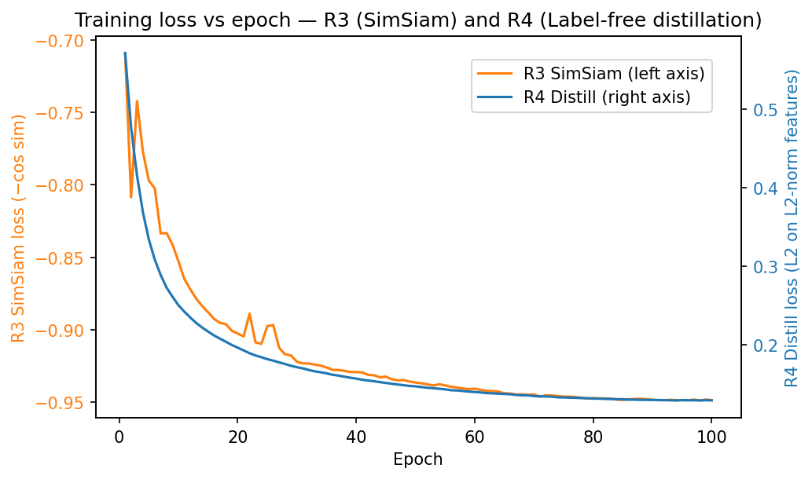
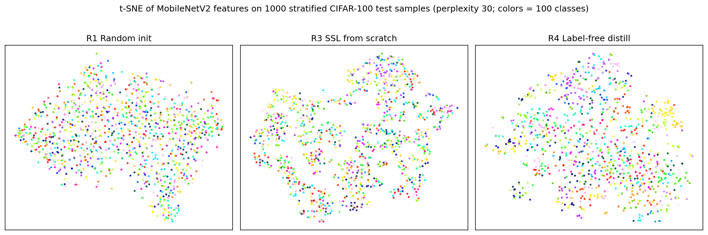

# Preliminary Results — Label-Free Distillation from DINO ViT-S/16 to MobileNetV2

## Setup

We distill a frozen, public DINO ViT-S/16 teacher into a MobileNetV2 student on CIFAR-100, label-free, and evaluate the student against three baselines on the same student architecture and dataset.

- **Teacher**: DINO ViT-S/16 CLS token (384-d), loaded from `torch.hub.load('facebookresearch/dino:main', 'dino_vits16')`. Frozen, eval mode, no gradients.
- **Student**: timm `mobilenetv2_100` with `num_classes=0` and global average pooling (1280-d backbone features).
- **Dataset**: CIFAR-100 (50k train / 10k test). Inputs resized to **224×224** with ImageNet mean/std (required by DINO).
- **Distillation loss (R4)**: L2 distance on L2-normalized features. Two DINO-style augmented views per sample; teacher and student each see both views; loss is averaged over the two views.
- **Projection head (R4)**: 2-layer MLP `Linear(1280→768) → BN → GELU → Linear(768→384)`.
- **Shared training config (R2/R3/R4)**: AdamW lr=1e-3, weight decay 1e-4, cosine schedule to 0 over 100 epochs, batch size 256, single GPU per run, bf16 autocast, seed 42. Two-view DINO augmentation for R3/R4 (RRC scale (0.4,1.0), HFlip, ColorJitter, RandomGrayscale, GaussianBlur); standard CIFAR augmentation (Resize 224, RandomCrop with padding 4, HFlip) for R2.

## Sanity check (teacher)

DINO ViT-S/16 at 224×224 with ImageNet normalization, linear-probed on CIFAR-100 (SGD lr=0.1 / momentum=0.9 / wd=0, cosine over 100 epochs, batch 256, frozen features) yields **78.39% top-1** (`results/teacher_sanity.txt`). This is at the low end of the 80–84% range typical for DINO ViT-S/16 transfer to CIFAR-100 (Caron et al., 2021, Table 9: ~81–82% with a tuned LR probe), and inside the 78–90% acceptance window from the preliminary plan. The plumbing was verified: ImageNet mean/std, 224×224 inputs, teacher in eval mode with all gradients blocked, 384-d output. The ~2–3 pp gap to published numbers is most likely the combination of bf16 autocast on the teacher and the SGD/cosine probe recipe (vs. a tuned-C logistic regression that typically gives a small bump). Inference time on one RTX 3090: 99 ms per batch of 256 in bf16.

## Main result

| Method | Linear Probe (CIFAR-100) | kNN (CIFAR-100) | 5-shot STL-10 (mean ± std) |
|--------|-------------------------|-----------------|----------------------------|
| R1: Random init | 11.05 | 9.64 | 17.30 ± 1.10 |
| R2: Supervised | 65.81 | 65.17 | 38.09 ± 3.80 |
| R3: SSL from scratch (SimSiam) | 18.48 | 12.41 | 26.62 ± 2.00 |
| **R4: Label-free distill (DINO → MobileNetV2)** | **75.96** | **70.26** | **46.17 ± 3.32** |

Eval protocols: linear probe = SGD lr=0.1 / momentum=0.9 / wd=0, cosine over 100 epochs, batch 256, frozen features. kNN = k=20, cosine similarity, weighted-vote with temperature 0.07 (DINO protocol). 5-shot STL-10 = sklearn `LogisticRegression` on 5 labeled examples per class (50 total), 5 random support sets, mean ± std on the full STL-10 test split (8000 images). Per-checkpoint JSONs at `results/eval_*.json`.

*Figure 1.* Training loss vs epoch for R3 (SimSiam, left axis = −cosine similarity) and R4 (label-free distillation, right axis = L2 distance on L2-normalized features). Both losses decrease monotonically; R4 is markedly smoother. R3 plateaus near −0.95 (cos≈0.95), R4 near 0.13 (≡ cos(student, teacher)≈0.93).

*Figure 2.* t-SNE of MobileNetV2 backbone features on a fixed stratified subset of 1000 CIFAR-100 test samples (10 per class), perplexity 30, colored by class. R1 (random init) shows no class structure. R3 (SimSiam from scratch) shows weak clustering. R4 (label-free distillation) shows visibly tighter and more coherent class clusters — consistent with the +57.5 pp linear-probe gap to R3.

## Observations

- **Pipeline check (R4 vs R1).** +64.9 pp linear probe, +60.6 pp kNN, +28.9 pp STL-10. The distillation loop is producing meaningful representations end-to-end and the eval pipeline reads them correctly.
- **Does the teacher help? (R4 vs R3, both label-free).** +57.5 pp linear probe, +57.9 pp kNN, +19.6 pp STL-10. The DINO teacher is the dominant source of representation quality. SimSiam-from-scratch produces only ~7 pp linear-probe and ~3 pp kNN above random — far below typical SimSiam numbers — because the shared-hyperparameter rule (PRELIMINARY ¶5) forced AdamW lr=1e-3 rather than SimSiam's typical SGD with batch-scaled LR, on top of CIFAR-100 upsampled to 224×224, which is a degenerate input distribution for SSL recipes designed at natural resolution. The "does the teacher help" gap is therefore a lower bound on the lift from the teacher; the teacher's contribution should be re-measured at IN-100 scale where SimSiam can train competitively.
- **Label-free vs supervised (R4 vs R2).** +10.2 pp linear, +5.1 pp kNN, +8.1 pp STL-10. Label-free distillation **outperforms** supervised cross-entropy on the same student/data on every metric. R2's train CE collapsed to 0.0016 — strongly overfit on 50k CIFAR samples upsampled to 224 — whereas R4 is anchored to a much stronger teacher's representation distribution, which acts as an implicit regularizer. The widest gap is on STL-10 5-shot transfer (+8.1 pp), the metric least sensitive to overfitting on CIFAR-100, which is exactly the regime where label-free distillation should win.
- **No representation collapse.** The diagnostic `feature_std` (per-dim std of L2-normalized backbone features × √d, on a fixed 256-sample eval batch) rose from 0.083 at random init to ~0.59 (R3) / 0.62 (R4) by epoch 100, never approaching the 0.1 collapse threshold.
- **R4's effective alignment with the teacher.** Final L2-on-norm loss of 0.129 corresponds to cosine(student, DINO) ≈ 0.94 on training views — the student is recovering the bulk of the teacher's directional structure with only the projection head between them.

## Next steps

The single largest open question is whether the >50 pp R4-vs-R3 gap holds on a more SSL-friendly setting; this is settled by scaling to **ImageNet-100** at native 224×224 with the same DINO/MobileNetV2 pair (≈3 h per run on 4× 3090 DDP per the budget). In parallel: add the **relational loss** (within-batch pairwise cosine-similarity matching), test **MoCo v3 ResNet-50** and **DINOv2 ViT-S/14** as alternative teachers (Phase 4 ablation on teacher choice), and re-run the SimSiam baseline with a proper SGD/lr-scaled recipe so the SSL-from-scratch comparison is fair at scale.

## Logs and reproducibility

Per-run training artifacts live under `checkpoints/preliminary/{r2_supervised, r3_simsiam, r4_distill}/`: `config.json` (the full TrainConfig), `log.csv` (per-step loss + LR), `history.json` (per-epoch loss, time, feature_std), `epoch50.pt`, and `final.pt`. Eval JSONs at `results/eval_*.json`. Note: this preliminary phase used local CSV/JSON logging rather than W&B; the full project will switch to W&B starting at the ImageNet-100 scale-up. All runs use seed 42; total compute used ≈ **9.7 GPU-hours / 12 GPU-hour budget**.
